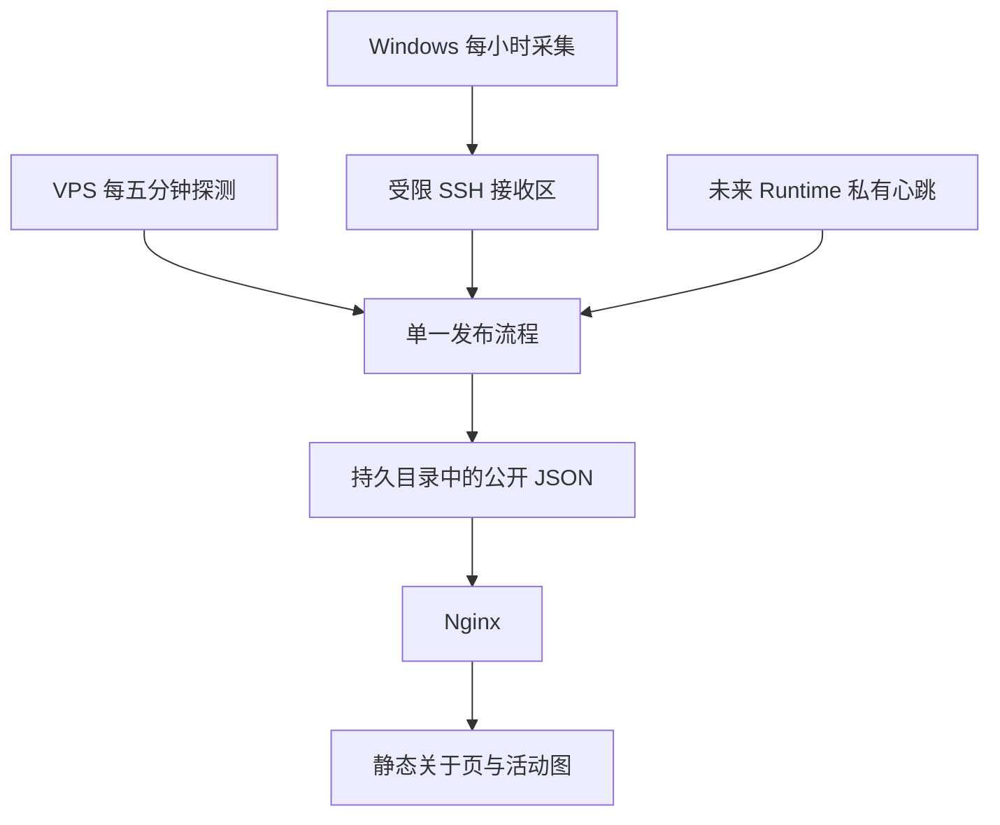

# ADR 0003：关于页运行状态与活动数据更新

状态：已实施并完成下列本地验证；尚未部署生产环境。

日期：2026-09-13。本文记录本次实施的架构与接入边界，不代表生产环境已启用监测。

## 1. 决策

关于页在活动图之前增加「运行状态」，固定展示 Moriium、Moriium Gallery、活动数据更新和 Enouia Runtime 四项。Enouia 归入 Enouia Runtime，不再单独探测网站入口；Moriium 和 Gallery 分别监测自己的入口；活动更新展开为 GitHub、Codex、Claude Code 三个来源；Runtime 等待未来部署后接入。

公开页面仍由 Astro 预渲染，Nginx 直接提供 HTML 和 JSON。状态采集与发布使用 Node 24 一次性脚本，由 systemd 每分钟运行，站点探测仍间隔五分钟。阅读请求不启动检测，也不连接作者数据库。已有 `/api/status/` 是认证后的后台运维接口，保持不变。

这允许数据独立于整站发布更新。即使作者 Node 服务停止，读者仍能读取已经生成的文件；采集停止后，浏览器根据观测有效期显示未知或过期。同机监测不代表各地访客的体验，整台 VPS 离线时关于页也不可访问。

## 2. 内容与设计

| 项目 | 检查内容 | 尚未配置时 |
| --- | --- | --- |
| Moriium | 正式入口 HTTPS、成功响应、HTML 类型及页面标识 | 状态未知 |
| Moriium Gallery | 独立站点正式入口与标识 | 尚未接入监测 |
| 活动数据更新 | 已公开批次与来源采集结果 | 尚未接入监测 |
| Enouia Runtime | 私有心跳报告 | 尚未接入监测 |

入口检查不证明所有图片、文章和交互都可用。正式地址在 `deploy/status/sites.json` 中配置；Gallery 默认为 `null`，不使用示例域名制造正常状态。

面板复用关于页的标题、缩进、细线和现有主题。每项使用原生 `details/summary` 展开，包含文字状态、检测或更新时间、90 天记录和中断／恢复事件。按 Morii 的补充要求，参考 OpenAI 状态页，将历史改为细竖条排列的时间带，附起止日期和图例；按后续修改将展示与保留范围扩展到 90 天，单条最宽 6 像素、高 28 像素，整带铺满行宽；手机端仍保留全部 90 天。

配色采用 Morii 提供的浅深色 OKLCH 对应值，仅作用于本板块：灰绿表示正常，砖红表示异常，土黄纯色表示观测不完整，雾蓝标记复核与未知，灰紫标记主动暂停。无数据保持空条。状态文字沿用正文颜色，颜色不是唯一线索。三种语言使用相同信息结构，没有新增全局字体、色板或持续动画。展开后的历史列表使用随网站主题切换的细滚动条与透明轨道。

## 3. 采集、接收与发布

Windows 继续使用现有采集器：Codex 通过本机 app-server 的 `account/usage/read` 读取账号侧日汇总；Claude Code 和 Cowork 使用本机固定版本 `ccusage@20.0.20`；GitHub 使用贡献日历。原始会话、账号凭据、任务内容不上传。

`activity:refresh` 保留手动快照与归档行为。新增 `activity:sync` 使用独立工作目录，首次从仓库快照初始化，以后在本机目录采集和归档。它不修改 Git 跟踪文件，不提交代码，也不部署整站。Windows 任务只在已登录会话运行，每小时一次；登录后延迟十五分钟补采，重叠任务忽略。

每批含固定生产者 `morii-workstation`、持久递增序号、批次时间、三个来源的最近尝试结果及白名单活动汇总。采集成功但数值不变仍是成功。单个来源失败时保留旧数据，其他来源可以继续发布。上传前先保存待发批次；下次运行先重传原批次，成功后再采集新批次。

专用 SSH alias 使用单独密钥、固定主机指纹和非交互连接。服务端 `authorized_keys` 的 `restrict,command="…"` 将该密钥限定为 `status-receive.mjs`，程序只读标准输入，忽略客户端命令。接收限制为 4 MiB、30 秒；它只写私有接收区，不写公开清单。重复或较旧序号不覆盖较新接收记录。

发布者持有唯一互斥锁，读取最新批次，检查序号、时间与历史保留条件。明显超前的时间拒收；新批次不能删除已公开日期或回退来源采集时间。先写完整的活动文件，再保存内部状态，最后原子替换公开清单。中途失败时旧清单仍能读取；重试会引用已经写完的文件。互斥锁不会自动抢占：进程意外退出后由运维在停止任务、确认无写入者后清理遗留锁。

所有运行数据位于代码发布目录之外。私有接收区、序号、内部探测状态、心跳与日志不得映射到 HTTP。公开目录仅包含经过重建的字段白名单。

## 4. 公开协议与时间口径

| URL | 数据 | 缓存 |
| --- | --- | --- |
| `/status-data/current.json` | 版本、生成时间、有效期、四项状态、历史、事件与活动文件引用 | 每次重新验证 |
| `/status-data/activity/<sha256>.json` | 现有 `ActivityData v1` | 内容哈希文件，可长期缓存 |

清单包含 `version: 1`、`generatedAt`、`validUntil`、`components` 和可空的 `activity`。每项记录 `id/state/observedAt/validUntil/history/events`。活动引用记录 `hash/url/publishedAt/receivedAt/sources`；各来源记录 `attemptedAt/succeededAt/result`。采集、接收、公开时间互不替代。

浏览器校验清单结构、白名单 URL、活动文件 SHA-256 及来源时间一致性。活动文件有效后才切换对应清单和图表。页面可见时每六十秒读取清单，隐藏时不发送请求，重新可见时补读。活动哈希不变时不重复下载；跨日仍重新计算显示日期，跨年增加年份。

活动图的初始 HTML 与后续刷新共用渲染函数，保证色块、统计、明细表和日期读数来自同一数据。更新恢复年份选择、日期、详情展开状态和焦点。无 JavaScript 时保留完整的构建快照，并明确说明快照性质；请求失败保留原内容，不用空图覆盖。

## 5. 状态与历史

站点连续三次失败确认中断，两次成功确认恢复；中间显示正在复核。连续计数与事件持久保存，超过十五分钟的缺测打断连续性。配置中的目标改变时重新积累证据。一次请求超时十秒，重定向视为失败，应配置最终正式入口。

每个来源超过三小时没有成功采集即为过期，最近一次失败但数据仍新鲜时显示部分异常。电脑离线不等于网站故障；只有日汇总不能推断 Morii 是否正在工作。日期继续沿用来源口径，Codex 不冒称北京时间。

90 天历史按北京时间自然日归档。正常表示当日截至当前的观测覆盖完整；异常表示记录过中断、部分异常或过期；缺测、复核阶段或中途接入显示观测不完整；没有样本显示无数据。接入前不补历史，不计算 SLA 或默认 100% 可用率。事件只声称“检测到中断／恢复”，不推断真实故障开始时间或原因。

Runtime 仅定义接入协议：在私有 `runtime.json` 写入 `version: 1`、ISO UTC `observedAt`、`state`。状态允许 `waiting/running/paused/degraded`，建议每分钟更新；超过三分钟失联。待机和主动暂停是正常工作模式。公开投影只保留状态与时间，额外字段不发布。本次不实现 Runtime 本身。

## 6. 部署与恢复

部署细节见 [状态服务操作说明](status-operations.md)。首版不购买独立监测节点，不建立独立状态网站，不增加公开写 API、访客追踪、账号额度展示、公告管理后台或第三方 AI 服务状态。

初始化时先确认站点地址、受限 SSH alias 与 Linux 账户权限，再生成首份快照，然后启用 Nginx 路由与 timer。最后注册 Windows 调度并观察首次完整采集、上传、公开链路。不能以任务注册成功代替运行成功。当前仓库实现不等于这些生产步骤已经执行。

停用时停止 Windows 任务和 VPS timer，保留快照及归档。关于页将按有效期显示过期；必要时回滚页面代码。整站回滚不回退活动数据。不要删除本机序号文件：若必须重建工作目录，下一序号必须高于服务端已接受值，并以已保留的活动归档初始化。

## 7. 验收与依据

测试覆盖三次失败／两次恢复、缺测、旧 JSON、数据部分失败、零新增、旧批次重传、并发锁、发布中断恢复、历史与时间回退拒绝、Runtime 失联、三语、跨年和闰日。浏览器检查覆盖焦点、日期、展开状态、主题与五个目标宽度。静态边界需要实际停止测试作者 Node 服务，再通过 Nginx 访问页面与公开 JSON。Linux systemd、SSH 账户与生产 TLS 仍需在目标 VPS 验收。

### 本次本地验证记录（2026-09-13）

- `pnpm verify` 通过：Astro 检查无错误或警告，379 项测试中 377 通过、0 失败，保留项目原有的 1 项跳过和 1 项待办；链接、隐私与静态渲染隔离检查通过。
- 补采后的快照重新构建成功。北京时间 14:26 采集到 GitHub 423 次贡献、Codex 1,413,305,596 tokens、Claude Code／Cowork 2,163,897,935 tokens。三项采集均成功，归档与仓库快照哈希一致。GitHub 查询窗口前移不再丢弃最早的归档日期，回归测试通过。
- 真实汇总经过本地接收、发布和哈希校验后，浏览器在下一轮轮询更新图表；保留所选 `2026-09-10`、展开状态和日期输入焦点。零新增的 Codex 也更新采集时间。
- 三种语言、明暗主题分别检查 375、390、768、1024、1440 像素，共 30 种组合无横向溢出；四行均保留 90 段时间带。键盘可展开详情并聚焦可滚动历史列表。
- 本机 Nginx 配置检查通过。实际启动并停止隔离的测试作者 Node 服务后，三语关于页和公开 JSON 仍返回 200，私有状态与接收路径返回 404，作者 API 返回 502。清单为 `no-cache`，哈希活动文件为一年缓存且内容哈希匹配。
- 无 JavaScript 回退已检查生成 HTML 中的快照说明和完整数据；尚未使用禁用 JavaScript 的浏览器模式单独验收。跨年与闰日由渲染测试覆盖，未修改真实系统时间进行浏览器验证。

上述 Nginx 验证在 Windows 本机完成，不替代 Linux VPS 验收。没有注册 Windows 定时任务、启用生产 timer、配置上传密钥、提交、推送或发布代码。生产正式地址与首次完整 SSH 上传链路仍待按操作说明确认。

一手参考：

- [OpenAI Status](https://status.openai.com/) 与 [Claude Status](https://status.claude.com/)：提取总体摘要、分项、历史的层次；按补充要求采用 OpenAI 式整行分段历史带，字体与布局沿用 Moriium。
- [Astro 默认预渲染](https://docs.astro.build/en/guides/on-demand-rendering/)：保持静态阅读边界。
- [Nginx 静态内容](https://nginx.org/en/docs/beginners_guide.html#serving_static_content) 与 [alias](https://nginx.org/en/docs/http/ngx_http_core_module.html#alias)：公开持久文件与代码目录分离。
- [OpenSSH authorized_keys](https://man.openbsd.org/sshd.8#AUTHORIZED_KEYS_FILE_FORMAT)：限定上传密钥用途。
- [Page Visibility API](https://developer.mozilla.org/en-US/docs/Web/API/Page_Visibility_API)：隐藏页面暂停读取。
