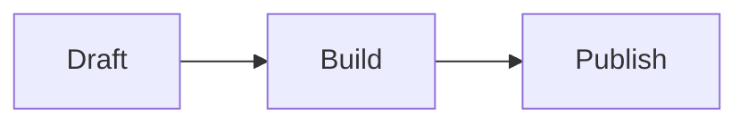

# Markdown extension reference

Use ordinary Markdown whenever possible. The following syntax is for content that Markdown cannot express. Pages CMS users should switch the body field to **Source** mode before editing it.

## Images and lightbox

```md

```

Images remain ordinary links without JavaScript. On image articles, activating a link loads PhotoSwipe and provides keyboard navigation, zoom, dragging, touch gestures, focus return, and close controls.

## Code

````md
```ts title="route.ts" showLineNumbers {2}
const language = 'zh';
console.log(language);
```
````

Expressive Code supports language labels, titles, terminal frames, line numbers, marked lines, wrapping, copying, and collapsible sections. Use its fence metadata rather than raw HTML.

## Math

```md
Inline: $E = mc^2$

$$
\int_0^1 x^2\,dx = \frac{1}{3}
$$
```

KaTeX renders both forms during the build. The page does not load a math runtime.

## Mermaid

````md

````

Mermaid loads only on marked articles, uses strict security mode, and exposes source text when rendering fails. Diagrams are drawn in the site's own colours, resolved from the page's tokens at render time and redrawn when the theme changes. Each diagram sits in a frame that opens fitted to the column width (never below 55%): drag to pan, Ctrl or Cmd with the wheel or a trackpad pinch to zoom, two-finger pinch on touch screens, `+` `-` `0` and the arrow keys once the frame has focus, and a bar under the frame with the scale and zoom and reset buttons. A plain wheel always scrolls the page, and on touch screens a vertical swipe scrolls past a diagram until the reader has moved it.

## Video

```md
::video{provider="youtube" id="VIDEO_ID" title="Readable video title" ratio="16/9"}
::video{provider="bilibili" id="BV_ID" title="Readable video title" ratio="16/9"}
::video{provider="local" src="/media/posts/example/video.mp4" title="Readable video title" ratio="16/9"}
```

YouTube and Bilibili render their player directly in the page with `loading="lazy"`: it loads without a click once it is within the browser's lazy-load distance -- in Chrome a screen or more ahead, so on a short article the provider is contacted on arrival -- needs no JavaScript, and never autoplays (Bilibili's player plays by default, so it is given `autoplay=0`). A caption notes that the video is served by a third party. New providers require directive validation and CSP changes. Local video uses native controls and `preload="none"`.

## GitHub repository cards

```md
::github{repo="owner/repository"}
```

Actions fetches repository metadata with `GITHUB_TOKEN` at build time using at most four workers. An absent or failed response becomes a normal GitHub link.

## Music cards

```md
::music{title="Track" artist="Artist" cover="/media/cover.webp" audio="/media/track.m4a" lrc="/media/track.lrc"}
::music{title="Track" artist="Artist" meting="https://approved.example/api?..."}
```

Audio never autoplays and uses `preload="none"`. Nothing about a remote track is requested until the reader presses play; that press fetches the track, its cover and lyrics, and starts it. Starting one card pauses the previous card. With the script bound, a card shows its cover (or a blue square), the title and artist, one line that carries the status or the lyric being sung, and a play button, a seek bar and the time; without it, a local track keeps the native audio player and the lyrics link. A track the service cannot play says so instead of showing the browser's error.

## Admonitions

```md
:::tip{title="Custom title"}
Useful detail.
:::

> [!WARNING]
> GitHub-style callouts work too.
```

Allowed kinds are `note`, `tip`, `important`, `warning`, and `caution`.

## Spoilers

```md
The answer is :spoiler[revealed on click, Enter, Space, or focus].
```

## Copy protection

Set `copyProtection: true` in one article's frontmatter. It discourages copying prose but deliberately leaves code, form controls, keyboard navigation, and assistive technology usable. It is not a security measure.

## Colons

A colon immediately followed by a word is directive syntax, wherever it appears in a line. Only the names on this page are Moriium's; any other directive is printed as the characters it was typed as, so `16:9`, `08:12` and `Note:this` survive as written, and a misspelled directive such as `:spolier[...]` shows itself instead of vanishing. A colon followed by a space, and the full-width `：`, are never directive syntax.
