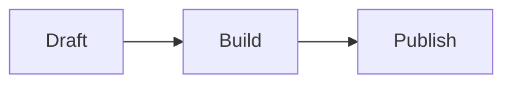

# Markdown extension reference

Use ordinary Markdown whenever possible. The following syntax is for content that Markdown cannot express. Pages CMS users should switch the body field to **Source** mode before editing it.

## Images and lightbox

```md

```

Images remain ordinary links without JavaScript. On image articles, activating a link loads PhotoSwipe and provides keyboard navigation, zoom, dragging, touch gestures, focus return, and close controls.

## Code

````md
```ts title="route.ts" showLineNumbers {2}
const language = 'zh';
console.log(language);
```
````

Expressive Code supports language labels, titles, terminal frames, line numbers, marked lines, wrapping, copying, and collapsible sections. Use its fence metadata rather than raw HTML.

## Math

```md
Inline: $E = mc^2$

$$
\int_0^1 x^2\,dx = \frac{1}{3}
$$
```

KaTeX renders both forms during the build. The page does not load a math runtime.

## Mermaid

````md

````

Mermaid loads only on marked articles, uses strict security mode, follows the current color theme, and exposes source text when rendering fails.

## Video

```md
::video{provider="youtube" id="VIDEO_ID" title="Readable video title" ratio="16/9"}
::video{provider="bilibili" id="BV_ID" title="Readable video title" ratio="16/9"}
::video{provider="local" src="/media/posts/example/video.mp4" title="Readable video title" ratio="16/9"}
```

YouTube and Bilibili remain placeholders until a reader chooses to load them. New providers require directive validation and CSP changes. Local video uses native controls and `preload="none"`.

## GitHub repository cards

```md
::github{repo="owner/repository"}
```

Actions fetches repository metadata with `GITHUB_TOKEN` at build time using at most four workers. An absent or failed response becomes a normal GitHub link.

## Music cards

```md
::music{title="Track" artist="Artist" cover="/media/cover.webp" audio="/media/track.m4a" lrc="/media/track.lrc"}
::music{title="Track" artist="Artist" meting="https://approved.example/api?..."}
```

Audio never autoplays and uses `preload="none"`. Remote details are requested only after the first press; playback requires another press. Starting one card pauses the previous card.

## Admonitions

```md
:::tip{title="Custom title"}
Useful detail.
:::

> [!WARNING]
> GitHub-style callouts work too.
```

Allowed kinds are `note`, `tip`, `important`, `warning`, and `caution`.

## Spoilers

```md
The answer is :spoiler[revealed on click, Enter, Space, or focus].
```

## Copy protection

Set `copyProtection: true` in one article's frontmatter. It discourages copying prose but deliberately leaves code, form controls, keyboard navigation, and assistive technology usable. It is not a security measure.
