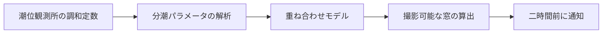

去年の冬、同じ干潟で四回空振りした。手に入る潮汐表は一時間刻みで、干潟が現れる窓は四十分ほどしかない。機材を担いで現場に着く頃には、水はもう戻っていた。


それで自分で計算することにした。古い方法で、潮位をいくつかの正弦成分の重ね合わせとして扱う：

$$
h(t) = H_0 + \sum_{i=1}^{n} A_i \cos(\omega_i t - \phi_i)
$$

$H_0$ は平均海面、$A_i$ と $\phi_i$ は各分潮の振幅と位相である。M2、S2、K1、O1 の四つだけを取れば、必要な精度は十分に満たせた。

## コード

```ts title="tide.ts" showLineNumbers {7} collapse={1-3}
type Constituent = { amplitude: number; speed: number; phase: number };

const HOURS = 3_600_000;

export function heightAt(base: number, parts: Constituent[], at: Date) {
  const hours = at.getTime() / HOURS;
  return parts.reduce((sum, part) => {
    const angle = (part.speed * hours - part.phase) * (Math.PI / 180);
    return sum + part.amplitude * Math.cos(angle);
  }, base);
}
```

七行目がこの中で唯一間違えやすい。分潮の速度は毎時の度数なので、`Math.cos` に渡す前にラジアンへ直さなければならない。直さなくても曲線は潮汐らしく見えてしまい、位相だけがずれる。ここで午後を一つ潰した。

## データの出どころ



調和定数は公開データで、観測所ごとに一組、数十年に一度しか更新されない。厄介なのは気圧と風で、実際の潮位を数十センチ押し上げたり下げたりするが、モデルはそれを知らない。

:::note{title="基準について"}
以下の高さはすべて当地の理論最低潮面が基準で、標高ではない。
:::

:::tip{title="楽な方法"}
おおよその時刻を知りたいだけなら、公式の潮汐表で足りる。自分で計算する意味があるのは、十分単位の精度が要るときだけだ。
:::

:::important
調和定数は観測所に紐づく。隣の観測所の定数で代用すると、誤差が大きすぎて計算する意味がなくなる。
:::

:::warning
このモデルに気象補正は入っていない。強風や気圧の急変時には、実測との差が半メートルに達することがある。
:::

:::caution
干潟の潮は正面からではなく背後から回り込んでくる。推算した窓より必ず多めに余裕を取ること。
:::

> [!TIP]
> 出発前にその日の風の予報をもう一度見るほうが、潮位を計算し直すより役に立つ。

そのとき撮れた時刻は :spoiler[午前四時五十分。推算した窓より十二分早かった]。

## 関連

::github{repo="Morii9961/Moriium"}

::video{provider="youtube" id="aqz-KE-bpKQ" title="干潟のタイムラプス" ratio="16/9"}

::music{title="Low Water" artist="Fixture Ensemble" meting="https://meting.spr-aachen.com/api?server=netease&type=song&id=1363298691"}

## 組版メモ

この段落は混植の確認用。日本語は「」と、。を使う。中文では「潮水退去」，用，和。English sentences sit here too, with commas, periods, and "straight quotes" — plus an em dash. 三種類の約物が並ぶと、行送り・約物詰め・欧文の分割位置の問題が出るので、この段落は消さないこと。
