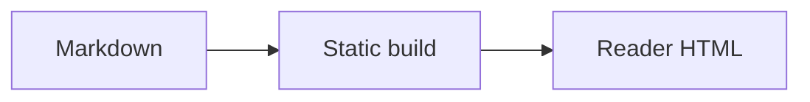

这张图片用于验证普通链接回退、键盘打开、缩放和返回焦点。


## 普通排版

段落里的 **粗体**、*强调*、`行内代码`、[站内链接](/zh/writing/)、~~删除线~~ 与脚注引用[^measure]，都要在中文行里保持正确的间距。夹在汉字之间的数字和西文同样如此，例如 Astro 7 与 42em。

### 列表

- 无序列表的第一项
- 第二项，下面还有一层
  - 嵌套的一层
    - 再嵌套一层
- 第三项

1. 有序列表的第一条
2. 第二条
3. 第三条

- [ ] 尚未完成的一项
- [x] 已经完成的一项

### 表格

| 层级 | 宽度 | 用途 |
| --- | ---: | --- |
| 正文 | 48rem | 长文阅读 |
| 媒体 | 62rem | 插图与图表 |
| 画廊 | 76rem | 摄影与题图 |

### 引用与分隔

> 装饰不会再先于内容出现。
> 结构由排版、留白和层级本身承担。

---

### 更深的标题

四级到六级标题用来确认：中文没有大小写可用时，层级仍然读得出来。

#### 四级标题

#### 五级与六级

##### 五级标题

###### 六级标题

### 行内元素

按 <kbd>Ctrl</kbd> + <kbd>K</kbd> 打开搜索。<mark>高亮</mark>、<abbr title="Cascading Style Sheets">CSS</abbr>、下标 H<sub>2</sub>O 和上标 x<sup>2</sup> 都会在正文里出现。

<details>
<summary>折叠起来的补充说明</summary>

折叠块里也放得下段落和列表。

- 一条
- 两条

</details>

## 代码

```ts title="features.ts" showLineNumbers {3} collapse={1-2}
export function needsMermaid(source: string) {
  const fence = /```mermaid\\s/;
  return fence.test(source);
}
```

## 数学

行内公式 $E = mc^2$ 不需要浏览器脚本。块级公式同样在构建时完成：

$$
\int_0^1 x^2\,dx = \frac{1}{3}
$$

## Mermaid



下面的无效语法用于确认错误不会破坏整篇文章，并且原始内容仍然可读：

```mermaid
this is deliberately invalid mermaid syntax
```

## 扩展内容

:::note{title="注记"}
这是普通说明。
:::

:::tip{title="小提示"}
提示块允许自定义标题。
:::

:::important
重要信息使用文字与边线共同表达。
:::

:::warning
第三方内容只有在点击后才联网。
:::

:::caution
静态密文仍然允许离线猜测口令。
:::

> [!TIP]
> GitHub 风格的提示语法也会转换。

这句话包含 :spoiler[只有主动揭示后才看见的内容]。

::github{repo="Morii9961/Moriium"}

::video{provider="youtube" id="aqz-KE-bpKQ" title="视频加载验收" ratio="16/9"}

::music{title="Final Resonance" artist="ARForest" meting="https://meting.spr-aachen.com/api?server=netease&type=song&id=1363298691"}

[^measure]: 48rem 的正文宽度在 18.72px 字号下大约是每行 41 个汉字。
