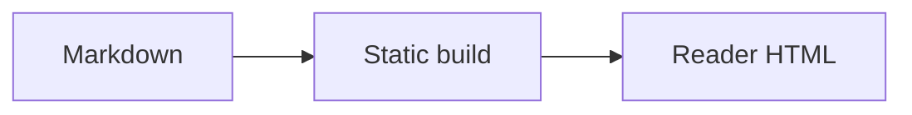

这张图片用于验证普通链接回退、键盘打开、缩放和返回焦点。


## 代码

```ts title="features.ts" showLineNumbers {3} collapse={1-2}
export function needsMermaid(source: string) {
  const fence = /```mermaid\\s/;
  return fence.test(source);
}
```

## 数学

行内公式 $E = mc^2$ 不需要浏览器脚本。块级公式同样在构建时完成：

$$
\int_0^1 x^2\,dx = \frac{1}{3}
$$

## Mermaid



下面的无效语法用于确认错误不会破坏整篇文章，并且原始内容仍然可读：

```mermaid
this is deliberately invalid mermaid syntax
```

## 扩展内容

:::note{title="注记"}
这是普通说明。
:::

:::tip{title="小提示"}
提示块允许自定义标题。
:::

:::important
重要信息使用文字与边线共同表达。
:::

:::warning
第三方内容只有在点击后才联网。
:::

:::caution
静态密文仍然允许离线猜测口令。
:::

> [!TIP]
> GitHub 风格的提示语法也会转换。

这句话包含 :spoiler[只有主动揭示后才看见的内容]。

::github{repo="Morii9961/Moriium"}

::video{provider="youtube" id="aqz-KE-bpKQ" title="视频加载验收" ratio="16/9"}

::music{title="Final Resonance" artist="ARForest" meting="https://meting.spr-aachen.com/api?server=netease&type=song&id=1363298691"}
