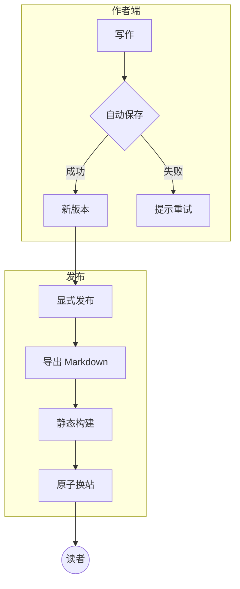
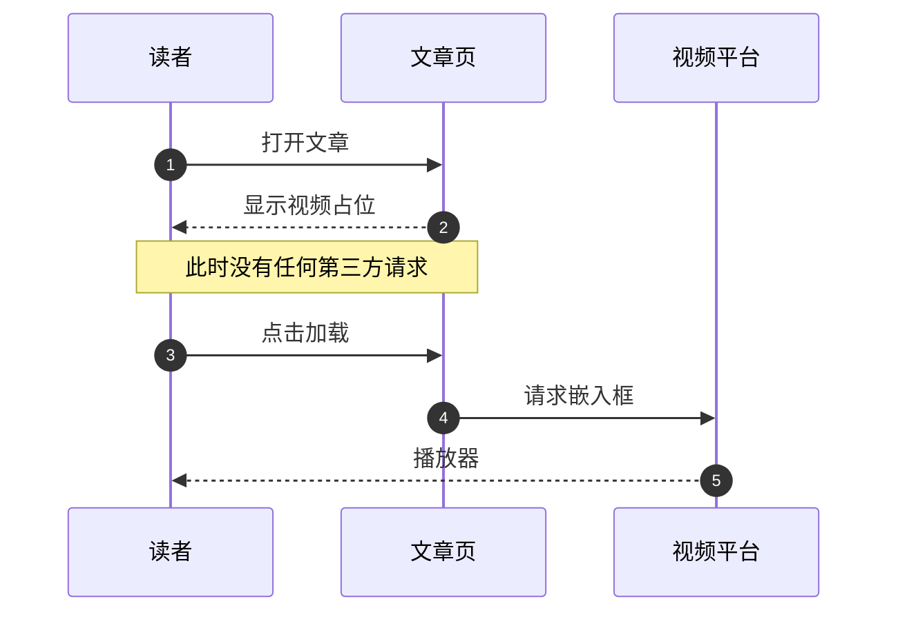
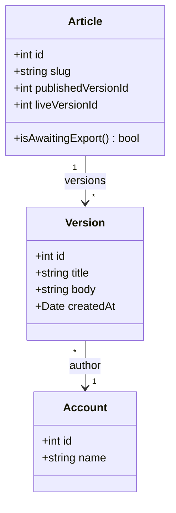
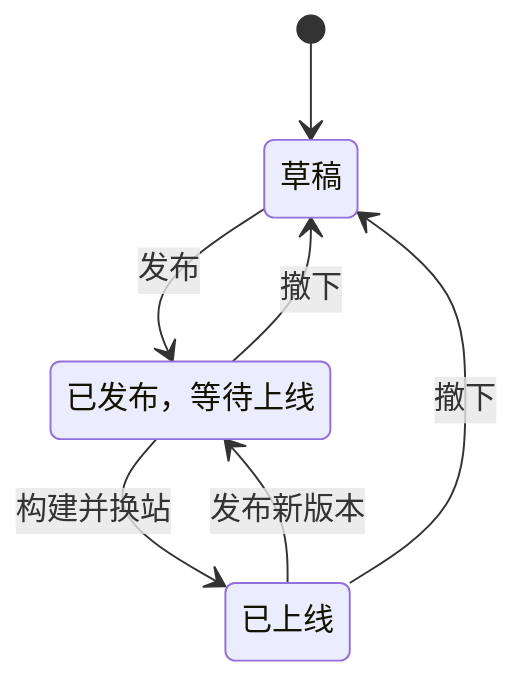
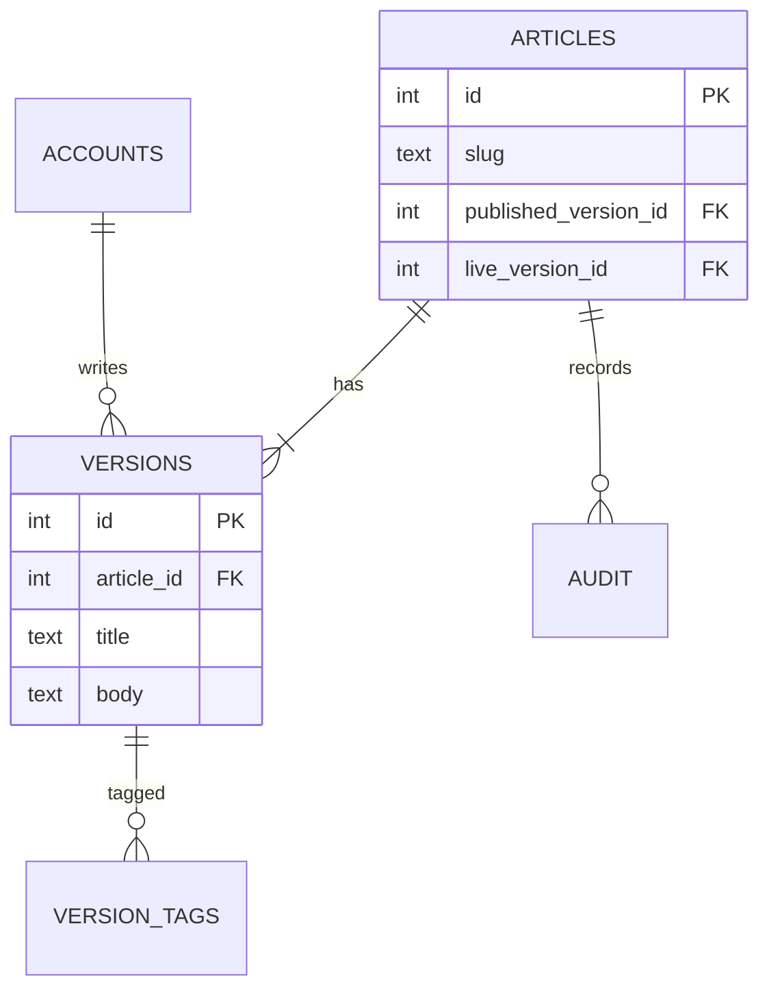
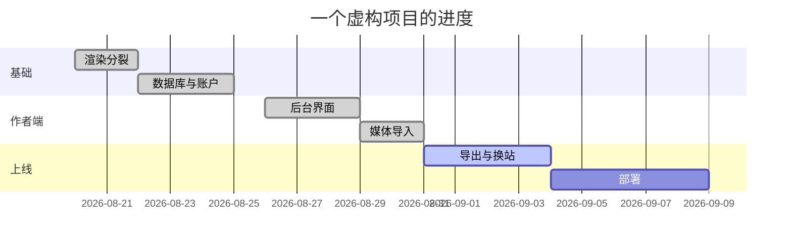
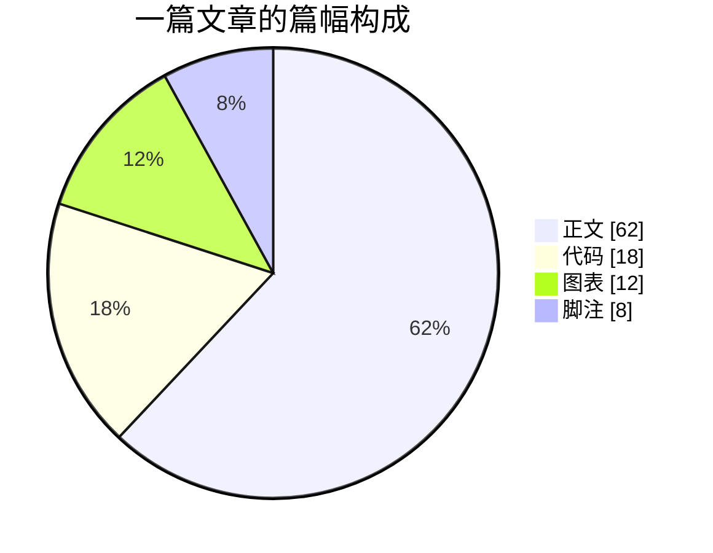
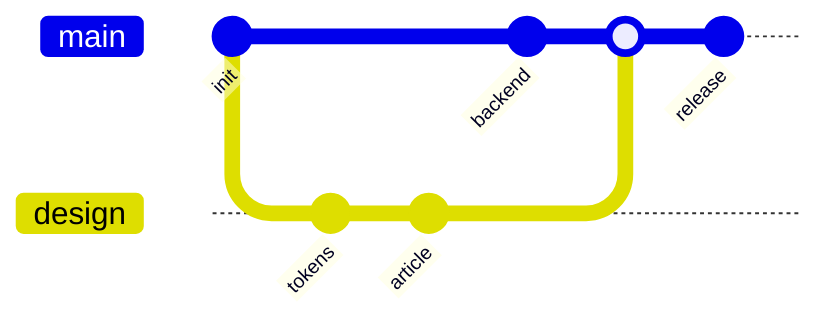
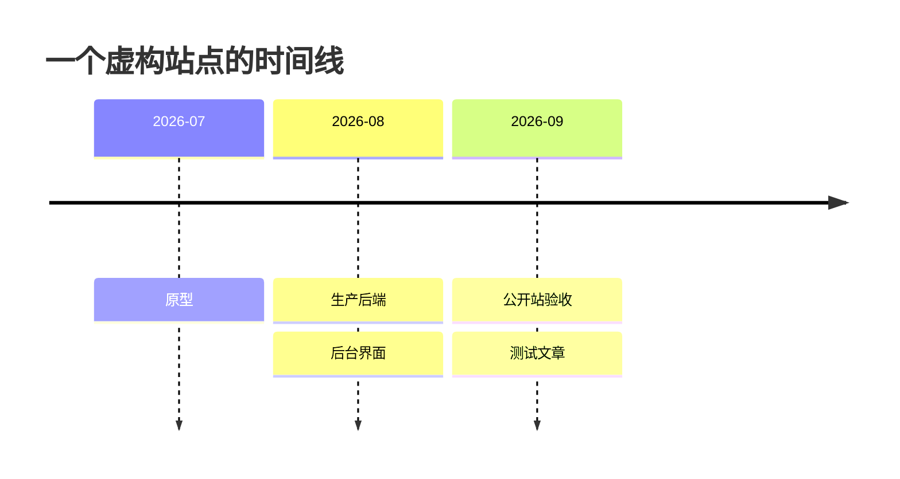

图表只在带有 Mermaid 代码块的文章里加载，普通文章不会下载这部分脚本。这篇把常用的图各画一张，切换一次主题，图表的颜色应该跟着变。

## 流程图

## 时序图

## 类图

## 状态图

## 实体关系图

## 甘特图

## 饼图

## Git 图

## 时间线

## 很宽的图

下面这张图一行排了十一个节点，在手机上一定放不下，应该能横向滚动或者缩放，而不是把页面撑宽：

